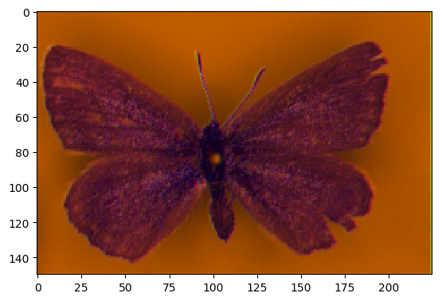

# ae-butterflies

The idea is to train an autoencoder to identify factors of variations in a set of butterfly specimens collected at different locations in Denmark. Clusters should represent biological subpopulations or biologically-relevant forms of variation, such as gender and wing spot patterns.

### Reconstruction

The following are three examples of a specimen:

  

The encoder's network pushes the image through an 'information bottleneck', from which it needs to reconstruct the image. It is effectively encouraged to find factors of variation relevant to reforming the image.
The reconstructions of the above three examples look as follows:

  

As you've probably noticed, the reconstructed images do not nearly contain as much color as we would've expected. We're working on that.

### Embeddings

Depending on the shape of the latent space, we can visualize what the image looks like when it is 'encoded':

  

Images embedded in the latent space can be clustered. The cluster centroids give us some information on the 'most typical example of a subpopulation'. These can then be decoded back to a butterfly image.

The following are 4 cluster means that have been decoded:

 

 

Note that the top two have darker wings than the bottom two. That's the difference between males and females. Other than that, the cluster means are very blurred. That's because the current data set contains a lot of variation in where the specimen is positioned in the image.

## Contact

Questions, comments and feedback can be submitted to the [issues tracker](https://github.com/wmkouw/ae-butterflies/issues).